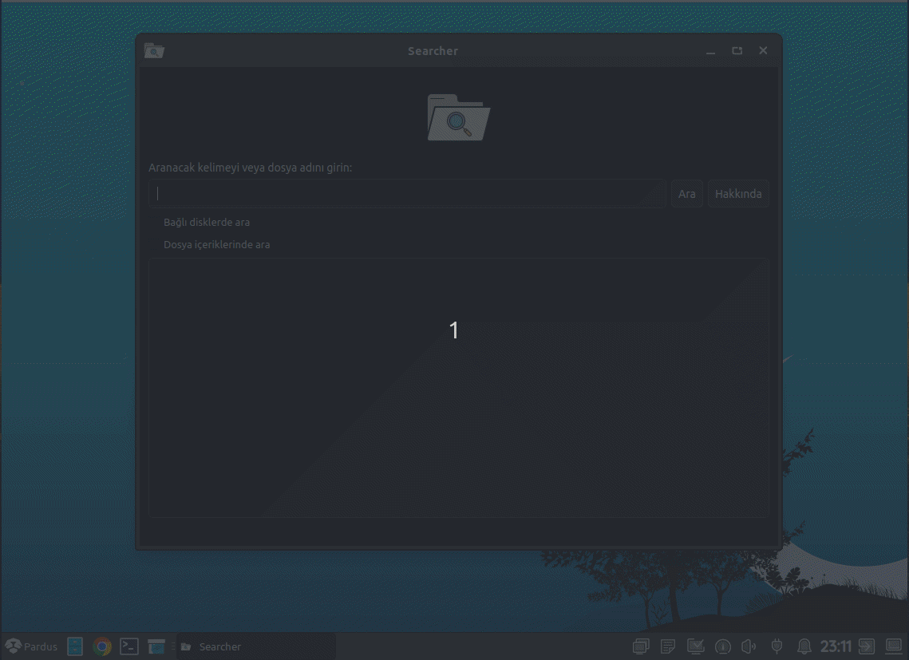

<a href="#">
    
</a>


# Searcher
Searcher allows users to search for files quickly and efficiently. It helps you get quick results by filtering specific file names or contents with extended search options. It also offers easy access using file managers to open file locations. With its user-friendly interface, Searcher is a tool that makes file management easy.

<h1 align="center">Searcher Logo</h1>

<p align="center">
  
</p>


----------------------

# Linux Screenshot
  

--------------------
Install Git Clone and Python3

Github Package Must Be Installed On Your Device.

git
```bash
sudo apt install git -y
```

Python3
```bash
sudo apt install python3 -y 

```

pip
```bash
sudo apt install python3-pip

```

# Required Libraries

PyQt5
```bash
pip install PyQt5
```
PyQt5-sip
```bash
pip install PyQt5 PyQt5-sip
```

PyQt5-tools
```bash
pip install PyQt5-tools
```

Required Libraries for Debian/Ubuntu
```bash
sudo apt-get install python3-pyqt5
sudo apt-get install qttools5-dev-tools
sudo apt-get install python3-pillow
sudo apt-get install python3-pypdf2
```
pillow
```bash
pip3 install pillow
```
pypdf2
```bash
pip3 install pypdf2
```

----------------------------------


# Installation
Install Searcher

```bash
sudo git clone https://github.com/cektor/Searcher.git
```
```bash
cd Searcher
```

```bash
python3 searcher.py

```

# To compile

NOTE: For Compilation Process pyinstaller must be installed. To Install If Not Installed.

pip install pyinstaller 

Linux Terminal 
```bash
pytohn3 -m pyinstaller --onefile --windowed searcher.py
```

MacOS VSCode Terminal 
```bash
pyinstaller --onefile --noconsole searcher.py
```

# To install directly on Linux


Linux (based debian) Terminal: Linux (debian based distributions) To install directly from Terminal.
```bash
wget -O Setup_Linux64.deb https://github.com/cektor/Searcher/releases/download/1.00/Setup_Linux64.deb && sudo apt install ./Setup_Linux64.deb && sudo apt-get install -f -y
```


Release Page: https://github.com/cektor/Searcher/releases/tag/1.00

----------------------------------
